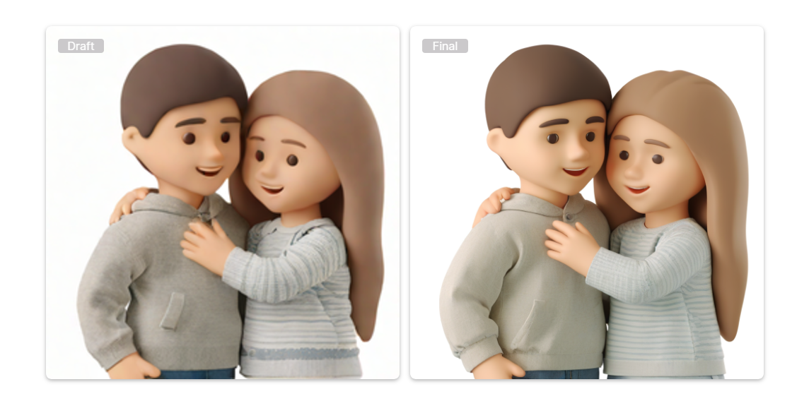
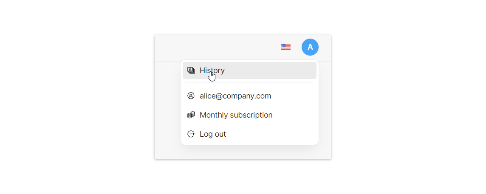
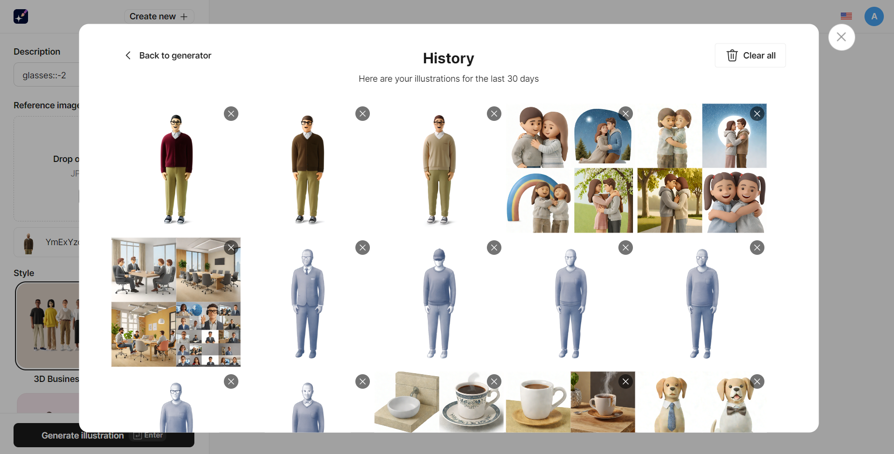

---
# Page settings
layout: default
keywords:
comments: false

# Hero section
title: Illustration Generator
description: Illustration Generator is an AI-powered text-to-image and image-to-image art maker.
icon: 'illustration-generator'

# Micro navigation
micro_nav: false

# # Page navigation
# page_nav:
#     next:
#         content: Pichon
#         url: '/pichon-docs'
---
By providing text prompts or reference images to the generator, you can create visuals for web, desktop, and mobile apps, social media, marketing, and other design needs. The AI model is trained on visuals crafted by Icons8 artists, ensuring the consistency and professional look of resulting AI artwork.

Illustration Generator is free for experimenting with [drafts](#drafts-and-final-illustrations). Final illustrations are available with a subscription to a paid plan, which also includes a 30-day history and commercial use.

### Drafts and final illustrations

Think of drafts as sketches or previews. They let you get an idea of how the final image will look and quickly iterate before generating the enhanced image. You can generate any number of drafts for free until you’re happy with the suggested image. Final images are way more detailed than drafts and require more computing power and generation time. To finalize drafts, you’ve got to have a subscription.

The example below shows the difference between drafts (left) and final images.

### Before you started

To get the maximum out of Illustration Generator you will need a subscription. Follow these steps:

1. Create an Icons8 account or log in if you already have one.
2. Go to <a href="https://icons8.com/illustration-generator" target="_blank">Illustration Generator</a>. In the upper-right corner, click **Upgrade**.
3. Choose the monthly or annual plan and provide your card details.

### Generating images

#### Text-to-image

Prompts are simple text instructions that explain to the AI what you want to see in the illustration. For better results, we recommend that you use short, straightforward descriptions, delimiting them with commas or semicolons. Example: "funny cat in a silly hat, sitting in a basket".

To generate and illustrartion:

1. In the left panel, enter a text prompt in the **Description** field. Describe the image you want to create.
2. Pick a style.
3. Pick an aspect ratio for the image.
4. Click on the **Generate drafts** button or press `Enter` to see preliminary versions of your image.
5. Refine and iterate. Adjust your text prompt as needed and generate new drafts until you are satisfied with the preview. To create variations of a specific draft, click the **Make Variations** button.
6. Once satisfied with the draft, click **Finalize** to create a detailed final version.
7. Click **Download** or use the **Copy** button to copy-paste the image where you need it.

<video autoplay="" muted="" loop="" playsinline="" width="auto" poster="/public/shapes-transform1placeholder.png" height="auto"><source src="/public/illustration-generator1.mp4" type="video/mp4"></video>

    
<strong>Tips:</strong> Here are some tips for prompting in Illustration Generator.

    
<strong>Do's</strong>

    <ul>
        <li>Use synonyms to better convey your idea. For example, ”shy, modest girl in an old antique dusty library.”</li>
        <li>Use adjectives and participles to add details. Example: “happy man sitting on the beach smiling“.</li>
        <li>Check your spelling.</li>
    </ul>
    
<strong>Don’ts</strong>

    <ul>
        <li>Don’t try talking to Human Generator like you do with ChatGPT.</li>
        <li>Don’t use brackets and parentheses.</li>
        <li>Don’t use capitalization.</li>
    </ul>

#### Image-to-Image

Using reference images is handy when you have a clear vision of what you want or when you struggle to find the right words to describe your idea. By uploading a reference image, you can make the creative process more efficient and precise.

Unlike text-to-image generation, using a reference image creates the final image immediately, without generating drafts, and with the aspect ratio of the reference image.

To generate an illustration from a reference image:

1. In the left panel, enable the **Reference image** toggle.
2. Click on the **Upload image** button to select an image from your device.
3. Pick a style.
4. Pick an aspect ratio for the image.
5. Click **Generate illustration** or press `Enter`.
6. (optional) To regenerate the image, click **Generate illustration** once again. To make adjustments, type your desired changes in the Description field and regenerate the illustration.
7. Click **Download** or use the **Copy** button to copy-paste the image wherever you want it.

<video autoplay="" muted="" loop="" playsinline="" width="auto" poster="/public/shapes-transform1placeholder.png" height="auto"><source src="/public/illustration-generator2.mp4" type="video/mp4"></video>

    
<strong>Tip:</strong> For reference images, you can use our <a href="https://icons8.com/illustrations" target="_blank">illustrations</a> and <a href="https://icons8.com/photos" target="_blank">photos</a>. We're totally okay with that.

### Generation history
If you want to revisit drafts and illustrations you generated earlier, you can find them in **History**.

     
<strong>Note:</strong> To save the history of your generations, you need to be signed in when working with Illustration Generator.

To view the history:

1. In the upper-right corner, click on your profile.
2. Click **History**.

 

You’ll see the gallery of your generations for the previous 30 days.

In the History gallery, you can:

* Click on an image to get back and edit it in Illustration Generator.
* Click `x` to delete an image.
* Delete all images from the gallery using the **Clear all** button.

